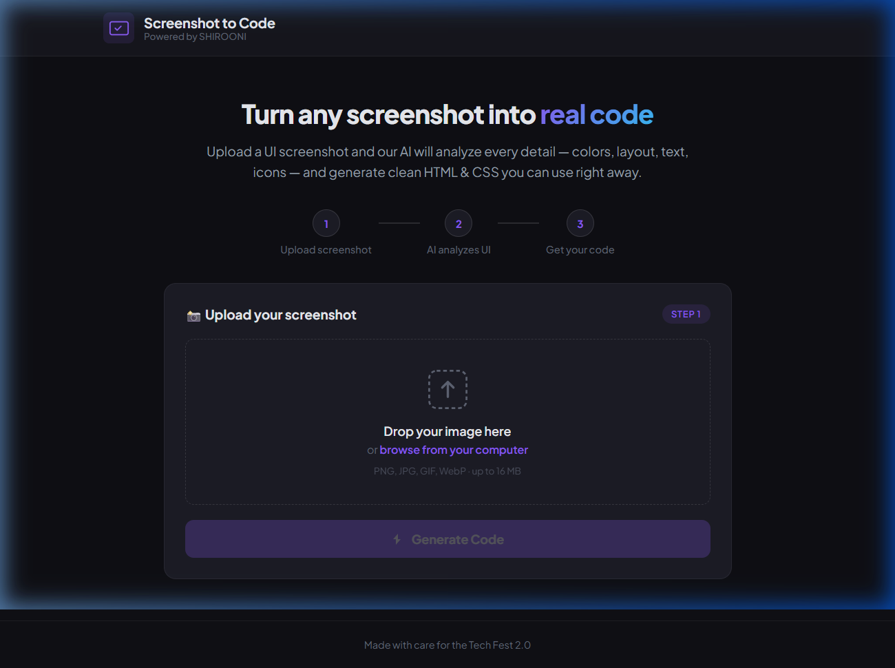
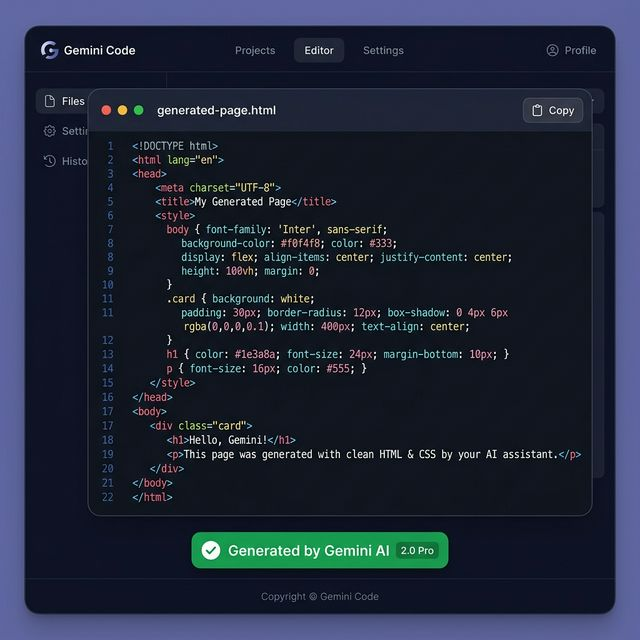

# ⚡ Screenshot to Code Generator

> **Turn any UI screenshot into clean, ready-to-use HTML & CSS code — powered by AI.**

---

## ❓ Problem Statement

Developers and designers often need to convert UI mockups, screenshots, or design references into working HTML & CSS code. Doing this manually is **time-consuming, repetitive, and error-prone** — especially for rapid prototyping, hackathons, or learning projects.

There's no simple tool that lets you upload a screenshot and instantly get matching code.

---

## 💡 Our Solution

**Screenshot to Code Generator** is a web app where users upload any UI screenshot and our **Gemini AI** analyzes every visual detail — text, colors, layout, icons, spacing — and generates a **complete, self-contained HTML file with embedded CSS** that recreates the UI. Just copy, paste, and it works.

---

## 🎥 Demo — How It Works

| Step | Action |
|------|--------|
| **1. Upload** | Open the app → Drag & drop or browse for a UI screenshot |
| **2. Generate** | Click the **"Generate Code"** button |
| **3. Wait** | AI analyzes the screenshot (10–20 seconds) |
| **4. Get Code** | A complete HTML + CSS file appears in the code box |
| **5. Copy** | Click **"Copy"** → Paste into any `.html` file → Open in browser |

### Quick Steps:

```
1. Open http://127.0.0.1:5000 in your browser
2. Upload any UI screenshot (PNG, JPG, WebP, etc.)
3. Click "Generate Code"
4. Wait for AI to analyze the screenshot
5. Copy the generated code
6. Paste into a new .html file and open it — done!
```

---

## 🛠 Tech Stack

| Layer | Technology |
|-------|-----------|
| **Frontend** | HTML5, CSS3, JavaScript (Vanilla) |
| **Backend** | Python, Flask |
| **AI Model** | Google Gemini 3 Flash (via `google-genai` SDK) |
| **Image Handling** | Pillow (PIL) |
| **Storage** | Browser localStorage (history feature) |
| **Font** | Plus Jakarta Sans (Google Fonts) |
| **Design** | Dark theme, humanized UI, modern aesthetics |

---

## ⚙️ Setup Instructions

### Prerequisites
- Python 3.10 or higher
- A Gemini API key ([Get one free here](https://aistudio.google.com/app/apikey))

### Local Installation

```bash
# 1. Clone or download the project
cd screenshot-to-code

# 2. Install dependencies
pip install -r requirements.txt

# 3. Create your .env file
cp .env.example .env
# Edit .env and add your Gemini API key:
# GEMINI_API_KEY=your-api-key-here

# 4. Run the app
python app.py

# 5. Open in browser
# http://127.0.0.1:5000
```

### Dependencies
```
Flask==3.1.0
Pillow==11.1.0
Werkzeug==3.1.3
google-genai
python-dotenv
gunicorn
```

---

## 🚀 Deployment

### Deploy to Render (Recommended)

1. Push your code to GitHub
2. Go to [render.com](https://render.com) → New → Web Service
3. Connect your GitHub repo
4. Render auto-detects `render.yaml` — just add your environment variable:
   - `GEMINI_API_KEY` = your API key
5. Click **Deploy** — done!

### Deploy to Heroku

```bash
# Login to Heroku
heroku login

# Create app
heroku create screenshot-to-code

# Set API key
heroku config:set GEMINI_API_KEY=your-api-key-here
heroku config:set FLASK_DEBUG=false

# Deploy
git push heroku main
```

### Deploy to Railway

1. Push to GitHub
2. Go to [railway.app](https://railway.app) → New Project → Deploy from GitHub
3. Add environment variable: `GEMINI_API_KEY`
4. Railway auto-detects the `Procfile` — deploys automatically

### Environment Variables

| Variable | Required | Default | Description |
|----------|---------|---------|-------------|
| `GEMINI_API_KEY` | ✅ Yes | — | Your Google Gemini API key |
| `GEMINI_MODEL` | No | `gemini-3-flash-preview` | AI model to use |
| `FLASK_DEBUG` | No | `true` | Set to `false` in production |
| `PORT` | No | `5000` | Server port |

---

## 📸 Screenshots

### Home Page — Upload Interface


### Generated Code Output


---

## 🌟 Key Features

| Feature | Description |
|---------|-------------|
| 🖼️ **Drag & Drop Upload** | Simply drag a screenshot or browse files |
| 🤖 **AI-Powered Analysis** | Gemini 3 Flash scans text, colors, layout, icons, spacing |
| 📝 **Complete HTML Output** | Single self-contained file with embedded CSS |
| 📋 **One-Click Copy** | Copy generated code to clipboard instantly |
| 🕘 **Generation History** | All generations saved in localStorage with thumbnail, timestamp, and code |
| 🔄 **Load Past Code** | Click "Load" to instantly revisit any previous generation |
| 🎨 **Color Matching** | AI matches exact colors from the screenshot |
| 📱 **Responsive Code** | Generated code includes media queries |
| 🌙 **Dark Theme UI** | Beautiful, polished, human-friendly interface |
| ⚡ **Fast Generation** | Results in 10–20 seconds |
| 🔒 **Privacy** | Uploaded images are deleted after processing |
| 🚫 **No Sign-up** | No login required — just upload and generate |

---

## 📁 Project Structure

```
screenshot-to-code/
│
├── app.py                  # Flask backend — routes + Gemini AI integration
├── requirements.txt        # Python dependencies
├── README.md               # Project walkthrough (this file)
├── STRUCTURE.md            # Detailed project structure + data flow diagram
│
├── templates/
│   └── index.html          # Main HTML page (upload, output, history panels)
│
├── static/
│   ├── style.css           # Stylesheet (dark humanized theme)
│   └── script.js           # Frontend logic (upload, API, copy, localStorage history)
│
├── screenshots/            # README screenshots
│   ├── home-page.png
│   └── code-output.png
│
└── uploads/                # Temp folder for uploaded images (auto-cleaned)
```

---

## 🔮 Future Scope

| Feature | Description |
|---------|-------------|
| 🎯 **Higher Accuracy** | Fine-tune prompts or use Gemini Pro for pixel-perfect results |
| 📦 **Multiple Frameworks** | Generate React, Vue, or Tailwind CSS code |
| 🖥️ **Live Preview** | Show a real-time preview of the generated code alongside it |
| 📐 **Component Detection** | Break the UI into reusable components automatically |
| 🔄 **Iterative Refinement** | Let users give feedback to improve the generated code |
| 📁 **Export Options** | Download as `.html`, `.zip`, or push to GitHub |
| 🧩 **Template Library** | Pre-built templates for common UI patterns |
| 👥 **Collaboration** | Share generated code with team members |
| 🌐 **Deploy to Cloud** | One-click deploy generated pages to Vercel/Netlify |
| 🔐 **User Accounts** | Login to sync history across devices |

---

## 👥 Team

Built with ❤️ for Tech Fest 2.0

---

## 📄 License

This project is open source and available under the [MIT License](LICENSE).
